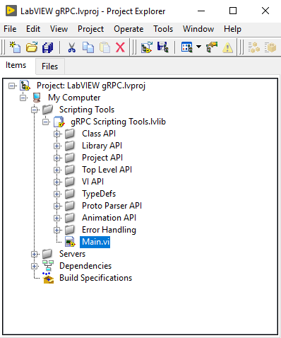

# gRPC Support for LabVIEW

This repo contains necessary C++ code and support VIs to implement a gRPC server in LabVIEW.

eexample/ExampleQueryServer.vi with query_server.proto defines a simple query service example that can be used for a variety of purposes.  

You can either use the service as defined to implement a generic server via gPRC or use the implementation
as a pattern to implement a gRPC service of your design.

the project supports Windows, Linux, and Linux RT.

## Note: This project is not yet complete
* Not all .proto data types are supported
* The VI generated has not yet been implemneted - VIs need to be implemented by hand to match the .proto file
* Extensive testing is not complete
* The names of the various generated methods, events, and VIs are subject to change until the 1.0 release

## Creating a LabVIEW gRPC Server

Download and unzip a release onto your computer.  You can use the .proto scripting tool on Windows or Linux.
Open the project LabVIEW gRPC.lvproj from the LabVIEW gRPC folder in LabVIEW 2019 or later:



Then open Main.vi from the project under Scripting Tools/gRPC Scripting Tools.lvlib:


* Select the .proto file you want to parse
* Select the LabVIEW project you want the server VIs added to
* Pick a name for the gRPC server
* Run the VI to generate the server

You can generate multiple proto files and add them to the same LabVIEW project.  You can also regenerate the same proto file into the same project with the same server name and the existing VIs will be updated to match the proto file. Code you add will not be touched.

Once the project is generated you can implement each of the server RPC methods.  The generated project contains a LabVIEW class with a method for each RPC method:


Each method contains an event structure that registers for a event that is sent when the RPC call is received:


There are also several other events that are created
* Server Stop - sent when the server is stopping.  In response the VI should stop
* Server Internal State - sent when the class state is updated by a call to `Set Server State.vi`
* Invoke Internal - Helper event to enable communication between RPC methods

When the server is started an instance of each of the RPC Method member VIs is run asynchronously to handle parallel calls to different RPC methods.

In you method implementation to must use the Get RPC Method Get Input VI to get the RPC Request parameters and you must call the Set Output VI To set the RPC response of the method and to indicate that the RPC call has completed.

## Using the LabVIEW Client API

Coming Soon

## Example

There is an example server ExampleQueryServer.vi and a corresponding C++ client (example_client).
When you build the C++ libraries the example client will also be built.

## SSL/TLS Support

You can enable SSL/TLS support on the server by passing in a path to a certificate and private key for the server.

You can generate the certificate with openssl using the following script.

```
mypass="password123"

echo Generate server key:
openssl genrsa -passout pass:$mypass -des3 -out server.key 4096

echo Generate server signing request:
openssl req -passin pass:$mypass -new -key server.key -out server.csr -subj  "/C=US/ST=TX/L=Austin/O=NI/OU=labview/CN=localhost"

echo Self-sign server certificate:
openssl x509 -req -passin pass:$mypass -days 365 -in server.csr -signkey server.key -set_serial 01 -out server.crt

echo Remove passphrase from server key:
openssl rsa -passin pass:$mypass -in server.key -out server.key

rm server.csr
```

Clients then must connect using the server certificate that was generated (server.cer) otherwise the connection will fail.

If you do not passing in a certificate then the server will use insecure gRPC.

## Building the server binaries
To build the binaries for the scripting tool or the gRPC server see [Building](src/Building.md) for instructions.

