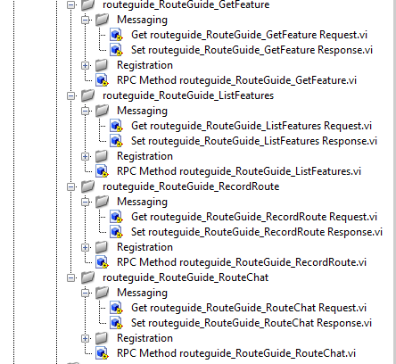
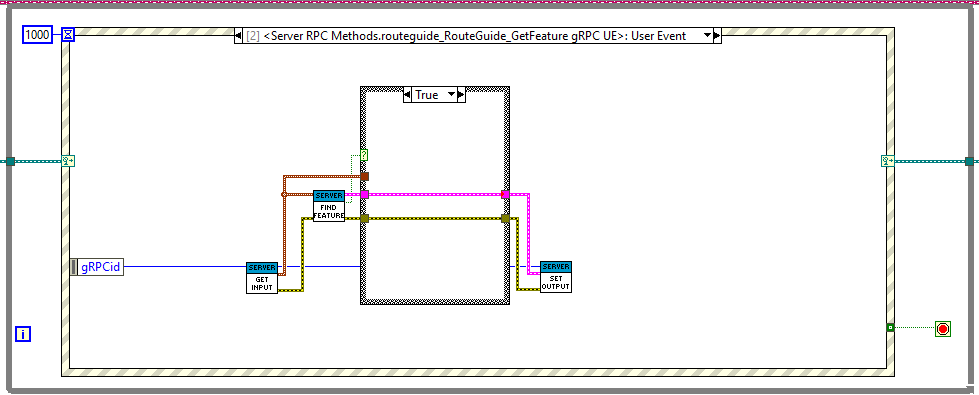
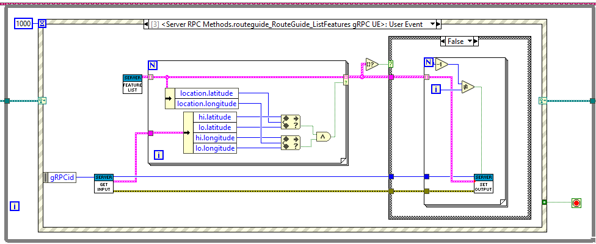
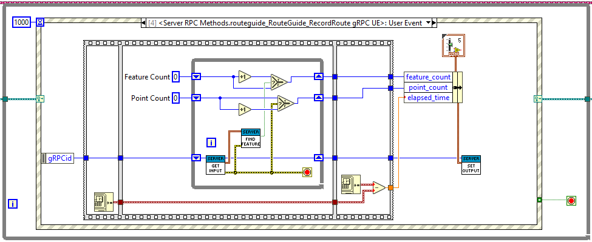
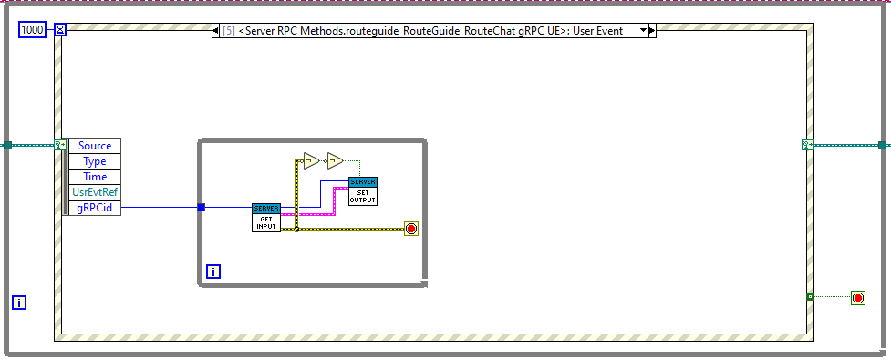
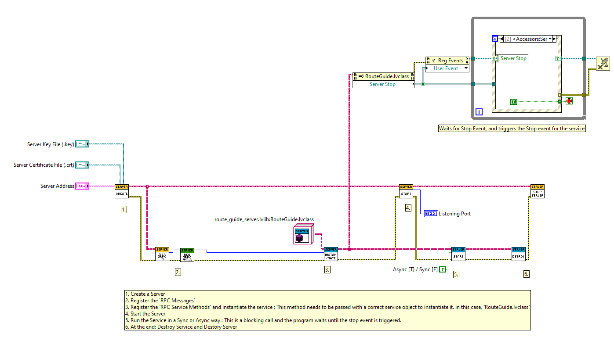
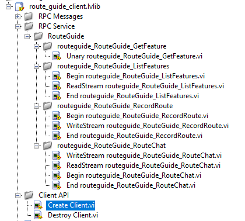
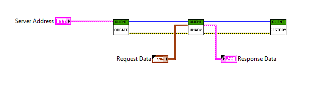
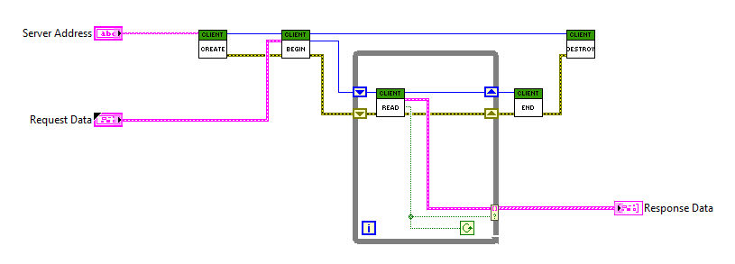
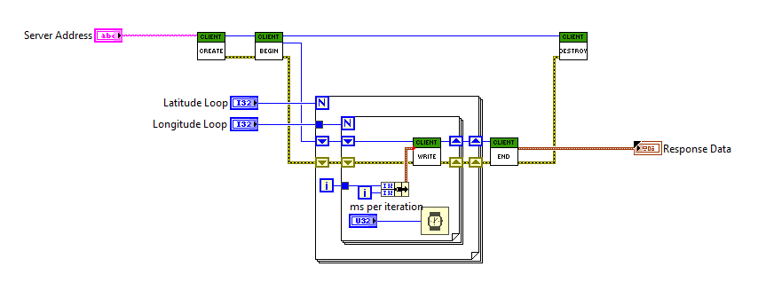

# Basics tutorial

### A basic tutorial introduction to gRPC in LabVIEW.

This tutorial provides a basic LabVIEW programmer’s introduction to working with gRPC.

By walking through this example you’ll learn how to:
* Define a service in a .proto file.
* Generate server and client code using the LabVIEW Server-Client Code Generator.
* Use the LabVIEW gRPC API to write a simple client and server for your service.

It assumes that you have read the [Introduction to gRPC](https://grpc.io/docs/what-is-grpc/introduction/) and are familiar with [protocol buffers](https://developers.google.com/protocol-buffers/docs/overview). You can find out more in the [proto3 language guide](https://developers.google.com/protocol-buffers/docs/proto3).

## Why use gRPC?

Our example is a simple route mapping application that lets clients get information about features on their route, create a summary of their route, and exchange route information such as traffic updates with the server and other clients.

With gRPC we can define our service once in a `.proto` file and generate clients and servers in any of gRPC’s supported languages, which in turn can be run in environments ranging from servers inside a large data center to your own tablet — all the complexity of communication between different languages and environments is handled for you by gRPC. We also get all the advantages of working with protocol buffers, including efficient serialization, a simple IDL, and easy interface updating.

## Example code and setup

The example code for this tutorial is in [grpc-labview/examples/route_guide](../examples/route_guide/). To download the example, clone the grpc repository by running the following command:

```sh
$ git clone https://github.com/ni/grpc-labview.git
```

Then go to `grpc-labview/examples/route_guide` in the repository to access the code.

You also should have the relevant tools installed to generate the server and client interface code - if you don’t already, follow the setup instructions in [Quick start](QuickStart.md).

## Defining the service

Your first step (as you’ll know from the [Introduction to gRPC](https://grpc.io/docs/what-is-grpc/introduction/) is to define the gRPC service and the method request and response types using [protocol buffers](https://developers.google.com/protocol-buffers/docs/overview). You can see the complete .proto file in `[examples/protos/route_guide.proto](../examples/protos/route_guide.proto)`.

To define a service, you specify a named `service` in your .proto file:

```proto
service RouteGuide {
   // (Method definitions not shown)
}
```

Then you define `rpc` methods inside your service definition, specifying their request and response types. gRPC lets you define four kinds of service method, all of which are used in the `RouteGuide` service:

* A *simple RPC* where the client sends a request to the server using the stub and waits for a response to come back, just like a normal function call.

```proto
// Obtains the feature at a given position.
rpc GetFeature(Point) returns (Feature) {}
```

* A *response-streaming RPC* where the client sends a request to the server and gets a stream to read a sequence of messages back. The client reads from the returned stream until there are no more messages. As you can see in the example, you specify a response-streaming method by placing the `stream` keyword before the response type.

```proto
// Obtains the Features available within the given Rectangle.  Results are
// streamed rather than returned at once (e.g. in a response message with a
// repeated field), as the rectangle may cover a large area and contain a
// huge number of features.
rpc ListFeatures(Rectangle) returns (stream Feature) {}
```

* A *request-streaming RPC* where the client writes a sequence of messages and sends them to the server, again using a provided stream. Once the client has finished writing the messages, it waits for the server to read them all and return its response. You specify a request-streaming method by placing the `stream` keyword before the request type.

```proto
// Accepts a stream of Points on a route being traversed, returning a
// RouteSummary when traversal is completed.
rpc RecordRoute(stream Point) returns (RouteSummary) {}
```

* A *bidirectionally-streaming RPC* where both sides send a sequence of messages using a read-write stream. The two streams operate independently, so clients and servers can read and write in whatever order they like: for example, the server could wait to receive all the client messages before writing its responses, or it could alternately read a message then write a message, or some other combination of reads and writes. The order of messages in each stream is preserved. You specify this type of method by placing the `stream` keyword before both the request and the response.

```proto
// Accepts a stream of RouteNotes sent while a route is being traversed,
// while receiving other RouteNotes (e.g. from other users).
rpc RouteChat(stream RouteNote) returns (stream RouteNote) {}
```

Your `.proto` file also contains protocol buffer message type definitions for all the request and response types used in our service methods - for example, here’s the `Point` message type:

```proto
// Points are represented as latitude-longitude pairs in the E7 representation
// (degrees multiplied by 10**7 and rounded to the nearest integer).
// Latitudes should be in the range +/- 90 degrees and longitude should be in
// the range +/- 180 degrees (inclusive).
message Point {
  int32 latitude = 1;
  int32 longitude = 2;
}
```

## Generating client and server code

Next you need to generate the gRPC client and server code from your .proto service definition.

First, install the required gRPC packages:

1. Download the latest package from [Releases](https://github.com/ni/grpc-labview/releases).
    1. Download and Unzip `grpc-labview.zip` which contains the released packages.
2. Install the following gRPC package,
    1. `ni_lib_labview_grpc_library-x.x.x.x.vip`
3. Install the following gRPC tool packages,
    1. `ni_lib_labview_grpc_servicer-x.x.x.x.vip`
    2. `ni_lib_grpc_server_and_client_template[2]-x.x.x.x.vip`

Use the following steps to generate the LabVIEW code:

1. Open `gRPC Template Creation Utility` from `LabVIEW -> Tools Menu -> gRPC -> Open gRPC Server-Client [2]-Code Generator`


2. Configure the Code Generator as below,
    1. Proto File Path: File path of the updated helloworld.proto from `examples/protos/route_guide.proto`
    2. Target Project: Project File Path in which the application should be generated. for example, `Test/route_guide/route_guide.lvproj`
    3. Generated Library Name: `route_guide`
    4. Generate: `Both`

3. Run the Code Generator

Note that as we’ve already provided a version of the generated code in the example directory, running this command on the `examples/route_guide/route_guide.lvproj` regenerates the appropriate file rather than createing a new one. The generated code files contain:

* server code for the route_guide.proto
  * `RPC Messages`, which contain the messages defined in the route_guide.proto
  * `RPC Service`, which contains the classes that defines the interfaces for implementation of the RouteGuide service
  * `Run Service.vi`, which contains the code to add the service to the gRPC server and run them.
* client code for the route_guide.proto
  * `RPC Messages`, which contains the messages defined in the route_guide.proto
  * `RPC Service`, which contains the methods the represent the RPC client API calls
  * `Client API`, which contains the API to create and destroy the client gRPC connection

## Creating the server

First let’s look at how you create a RouteGuide server. If you’re only interested in creating gRPC clients, you can skip this section and go straight to [Creating the client](#creating-the-client) (though you might find it interesting anyway!).

Creating and running a `RouteGuide` server breaks down into two work items:

* Implementing the server interface (logic) generated from our service definition with functions that perform the actual “work” of the service.
* Running a gRPC server to listen for requests from clients and transmit responses.

You can find the example `RouteGuide` server in [examples/route_guide/](../examples/route_guide/).

## Implementing RouteGuide Interface Logic

`route_guide_server.lvlib` has a `RouteGuide.lvclass` class which is the generated class for RouteGuide.


`RouteGuide.lvclass` implements all the RouteGuide service methods. In LabVIEW gRPC, all the method calls are `Event based`. There are two ways to implement each method,
1. Sync Implementation
2. Async Implementation

In `Sync` way, all the method calls are captured by the Event structure of the `Start Sync.vi`. Since, one event structure captures all the method events, the calls are synchronized. In `Async` way, all the method runs its own `continously running VI with a Event structure` so the methods can capture the event calls and process it parallely. The human-written code for the methods can be implemented in either `Sync` or `Async` event structure, yet the implementation logic will be the same.

Code generated for each method contains 3 important VIs that you should know,
1. `Get <MethodName> Request.vi`, which uses the gRPC ID to get the Request data of a method call
2. `Set <MethodName> Response.vi`, which uses the gRPC ID to set the response to a method call. This also indicates if the response is streaming or not.
3. `RPC <MethodName>.vi`, which is the Async VI for the method that can contain the human-writted logic for the method. This can be ignored, if you are doing a `Sync` call.



### Simple RPC

Let’s look at the simplest type first, `GetFeature`, which just gets a `Point` from the client and returns the corresponding feature information from its database in a `Feature`.



The method (event) is passed with a `Point` request for the RPC which is recieved using the `gRPC ID` and `Get routeguide_RouteGuide_GetFeature Request.vi`. It returns a `Feature` response by using the  `Set routeguide_RouteGuide_GetFeature Response.vi`

### Response-streaming RPC

Now let’s look at the next method. ListFeatures is a response-streaming RPC that sends multiple Features to the client.



Here the request message is a `Rectangle` (`Get routeguide_RouteGuide_ListFeatures Request.vi`) within which the client wants to find Features. Instead of returning a single response the method yields zero or more responses(`Set routeguide_RouteGuide_ListFeatures Response.vi`).

### Request-streaming RPC

The request-streaming method RecordRoute uses an iterator of request values and returns a single response value.



Request Message is recieved using the `Get routeguide_RouteGuide_RecordRoute Request.vi` until streaming ends, and the response is sent back using `Set routeguide_RouteGuide_RecordRoute Response.vi`.

### Bidirectional streaming RPC

Lastly let’s look at the bidirectionally-streaming method RouteChat.



This method’s semantics are a combination of those of the request-streaming method and the response-streaming method. It is passed an iterator of request values (`Get routeguide_RouteGuide_RouteChat Request.vi`) and is itself an iterator of response values (`Set routeguide_RouteGuide_RouteChat Response.vi`).

## Starting the server

Once you have implemented all the RouteGuide methods, the next step is to start up a gRPC server so that clients can actually use your service. The generated code contains a method called `Run Service.vi` which contains the pre-defined code sequence required to run the service on the server. This vi contains below code blocks and the only edit that user wants to do is on the Step 3, to make sure the Instantiate Service method is called with correct `Service Object`.

1. Create a Server
2. Register the `RPC Messages`
3. Register the `RPC Service Methods` and instantiate the service : This method needs to be passed with a correct service object to instantiate it. in this case, `RouteGuide.lvclass`
4. Start the Server
5. Run the Service in a Sync or Async way : This is a blocking call and the program waits until the stop event is triggered.
6. At the end: Destroy Service and Destory Server



*Note: When user wants to run more than one service on a server address, then the above code can be edited to add many service instantiation, start service calls in parallel to add the service to the same server.*

Run the VI to start the server!

## Creating the client

You can see the complete example client code in [examples/route_guide/](../examples/route_guide/).

### Creating a Client

To call service methods, we first need to create a Client.

We can instantiate and destroy the Client by using the `Create Client.vi` and `Destroy Client.vi` respectively from the `route_guide_client.lvlib`, generated from our .proto. 

### Calling service methods

For RPC methods that return a single response (“response-unary” methods), gRPC LabVIEW supports synchronous (blocking) control flow semantics. For response-streaming RPC methods, calls immediately return an iterator of response values. Calls to that iterator’s next() method block until the response to be yielded from the iterator becomes available.

The generated code contains all the required client methods in `RPC Service` under the `route_guide_client.lvlib`, generated from our .proto.



### Simple RPC

A synchronous call to the simple RPC GetFeature is nearly as straightforward as calling a vi. The RPC call waits for the server to respond, and will either return a response or raise an exception.



### Response-streaming RPC

To call the response-streaming `ListFeatures`, we will send the `request` data to the server and wait for the `Response` data until the streaming complete `success` bool is returned.



### Request-streaming RPC

Calling the request-streaming `RecordRoute` is similar to passing an iterator to a local method. Client will continously send the `Request` data and when done, it will call the `End` which will wait for the `Response` data.



### Bidirectional streaming RPC

Calling the bidirectionally-streaming `RouteChat` has (as is the case on the service-side) a combination of the request-streaming and response-streaming semantics:


## Try it out!

Run the server:

Run the `Run Service.vi`

To run the client, run any of the client methods. From the [example code](../examples/route_guide/), run any of the Test VIs:
* Unary RouteGuide Test.vi
* ResponseStreaming RouteGuide Test.vi
* RequestStreaming RouteGuide Test.vi
* Bidirectional Streaming RouteGuide Test.vi
