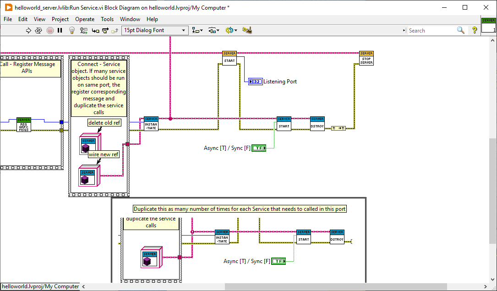

# Quick Start

This guide gets you started with gRPC in LabVIEW with a simple working example.

## Prerequisites

* LabVIEW 2019 or higher
* VIPM 2020 or higher

## LabVIEW gRPC

To install gRPC:

1. Download the latest package from [Releases](https://github.com/ni/grpc-labview/releases).
    1. Download and Unzip `grpc-labview.zip` which contains the released packages.
2. Install the following gRPC package,
    1. `ni_lib_labview_grpc_library-x.x.x.x.vip`

## LabVIEW gRPC Server & Client tools:

LabVIEW gRPC tools include the server base libraries and scripting tool to generate the server and client code from '.proto' service definitions. For the first part of our quick-start example, we have already generated the server and client code from [helloworld.proto](https://github.com/grpc/grpc/blob/v1.42.0/examples/protos/helloworld.proto), but you will need the tools for the rest of our quick start, as well as for your own project.

To install gRPC tools:

*Note: Install LabVIEW gRPC from above, before continuing with below steps*

1. Install the following tool packages,
    1. `ni_lib_labview_grpc_servicer-x.x.x.x.vip`
    2. `ni_lib_grpc_server_and_client_template[2]-x.x.x.x.vip`

## Download and Run the gRPC example application

To download the example:

You will need a local copy of the example code to work through this quick start. Download the example code from our GitHub repository (the following command clones the entire repository, but you just need the examples for this quick start and other tutorials):

```sh
# clone the repository to get the example code:
$ git clone https://github.com/ni/grpc-labview.git
# Navigate to the "hello, world" LabVIEW example using file explorer:
/grpc-labview/examples/helloworld/
```

To run the server and client:

From the `examples/helloworld` directory:

1. Open `helloworld.lvproj`

2. Run the server
    1. Run `Run greeter_server.vi` from helloworld.lvproj `/helloworld_server/helloworld_server.lvlib/` or from file explorer `/helloworld_server/`

3. Run the client
    1. Run `Run greeter_client.vi` from helloworld.lvproj `/helloworld_client/helloworld_client.lvlib/` or from file explorer `/helloworld_client/`

Congratulations! You have just run a client-server application with gRPC.

*Note: This LabVIEW server and client example can run with [Python client and server](https://grpc.io/docs/languages/python/quickstart/) respectively.*

## Update the gRPC example application

Now let’s look at how to update the application with an extra method on the server for the client to call. 

### Update the helloworld proto

Our gRPC service is defined using protocol buffers; you can find out lots more about how to define a service in a `.proto` file in [Introduction to gRPC](https://grpc.io/docs/what-is-grpc/introduction/). For now all you need to know is that both the server and the client code have a `SayHello` RPC method that takes a `HelloRequest` parameter from the client and returns a `HelloReply` from the server, and that this method is defined like this:

```proto
// The greeting service definition.
service Greeter {
  // Sends a greeting
  rpc SayHello (HelloRequest) returns (HelloReply) {}
}

// The request message containing the user's name.
message HelloRequest {
  string name = 1;
}

// The response message containing the greetings
message HelloReply {
  string message = 1;
}
```

Let’s update this so that the `Greeter` service has two methods. Edit `examples/protos/helloworld.proto` and update it with a new `SayHelloAgain` method, with the same request and response types:

```proto
// The greeting service definition.
service Greeter {
  // Sends a greeting
  rpc SayHello (HelloRequest) returns (HelloReply) {}
  // Sends another greeting
  rpc SayHelloAgain (HelloRequest) returns (HelloReply) {}
}

// The request message containing the user's name.
message HelloRequest {
  string name = 1;
}

// The response message containing the greetings
message HelloReply {
  string message = 1;
}
```

Remember to save the file!

### Regenerate the gRPC code

Next we need to update the gRPC code used by our application to use the new service definition.

1. Open `gRPC Template Creation Utility` from `LabVIEW -> Tools Menu -> gRPC -> Open gRPC Server-Client [2]-Code Generator`


2. Configure the Code Generator as below,
    1. Proto File Path: File path of the updated helloworld.proto from `examples/protos/helloworld.proto`
    2. Target Project: Project File Path of the example application from `examples/helloworld/helloworld.lvproj`
    3. Generated Library Name: `helloworld`
    4. Generate: `Both`

3. Run the Code Generator

This regenerates `helloworld.lvproj` which contains the helloworld server and client code with new a new service method.

*Note: In case, Client Code is not fully regenerated (as the tool is in beta version), delete the already created client code from the project and file explorer, and generate from scratch again*

### Update the server and client code

We now have new generated server and client code, but we still need to implement and call the new method in the human-written parts of our example application.

### Update the server

From the `examples/helloworld` directory:

1. Open `helloworld.lvproj`

2. Open `Start Sync.vi` from helloworld.lvproj `/helloworld_server/helloworld_server.lvlib/Greeter.lvclass/Server API/`

This is where the human-written parts of the application is present.

3. In the EventStructure, goto the case called `helloworld_Greeter_SayHelloAgain gRPC UE` (If not present, create the case) and implement the new method like this:


4. Open `Run Service.vi` from helloworld.lvproj

Note that before regeneration this was named `Run greeter_server.vi`.

5. Replace the current Greeter.lvclass constant with the new constant from project


6. Delete old reference and and connect new reference



Althougth old reference looks the same it needs to replaced. If not replaced the VIs will immediately exit after execution without error in `Run Service.vi`.

### Update the client

From the same project,

1. Open `Run greeter_client.vi` from helloworld.lvproj `/helloworld_client/helloworld_client.lvlib/`

2. Call the new method like this:


### [Optional] Configure feature toggles

[Feature Toggle documentation](./FeatureToggles.md)

### Run!

Just like we did before, from the `examples/helloworld` directory:

1. Open `helloworld.lvproj`

2. Run the server
    1. Run `Run greeter_server.vi` from helloworld.lvproj `/helloworld_server/helloworld_server.lvlib/` or from file explorer `/helloworld_server/`

3. Run the client
    1. Run `Run greeter_client.vi` from helloworld.lvproj `/helloworld_client/helloworld_client.lvlib/` or from file explorer `/helloworld_client/`

## What's next

* Learn how gRPC works in [Introduction to gRPC](https://grpc.io/docs/what-is-grpc/introduction/) and [Core concepts](https://grpc.io/docs/what-is-grpc/core-concepts/).
* Work through the [Basic tutorial](BasicsTutorial.md).
* Explore the [API reference](APIreference.md).