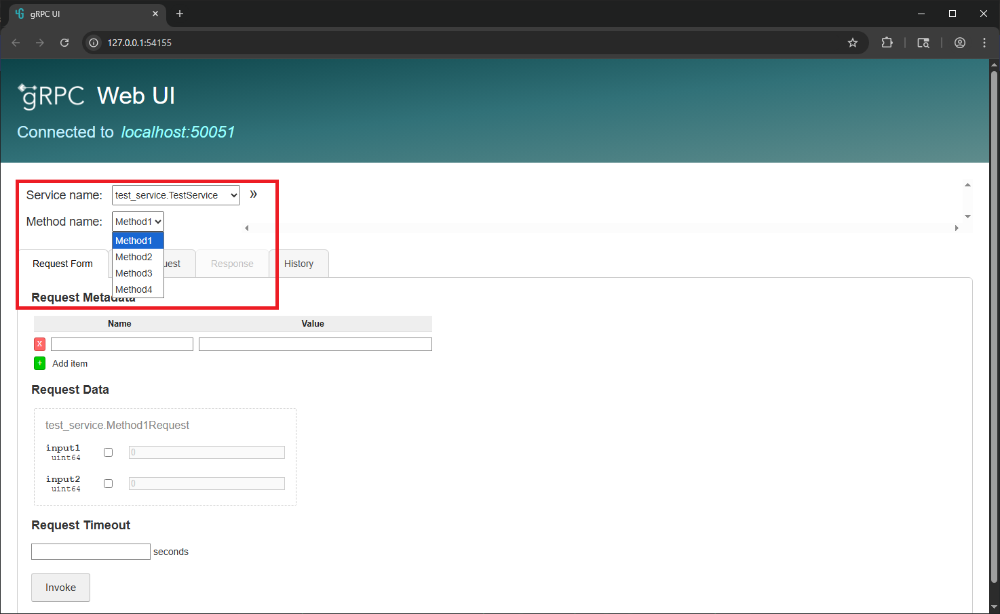
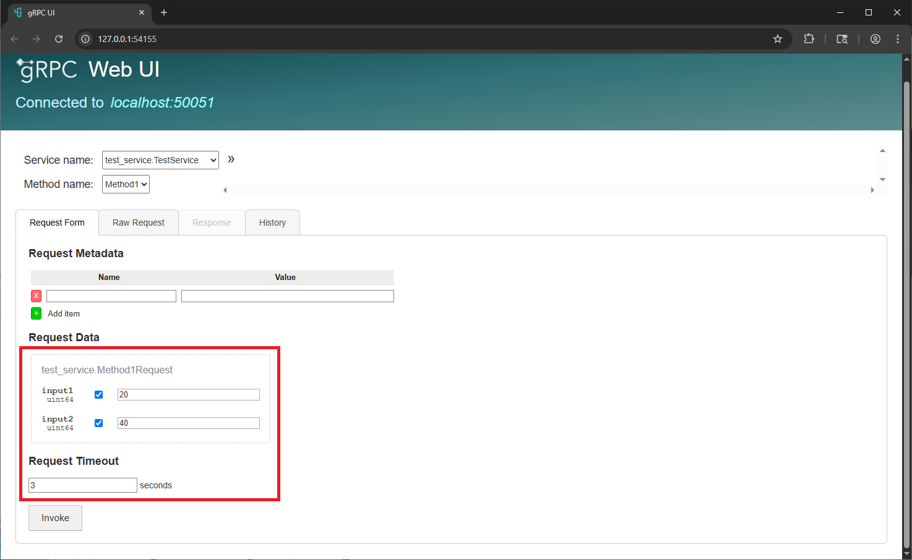
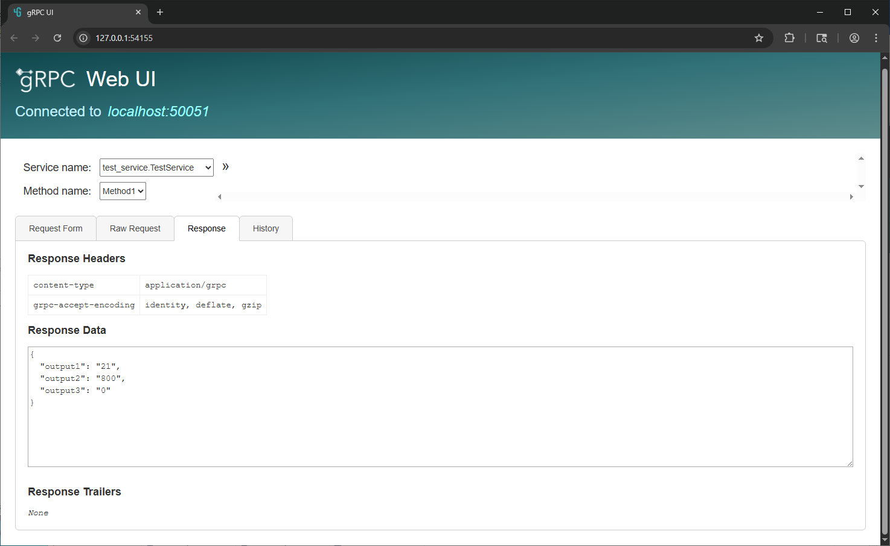

# gRPC Reflection

## What is reflection?
gRPC reflection is a mechanism that allows clients to dynamically discover the services, methods, and message types supported by a gRPC server at runtime, without requiring `.proto` files. With reflection enabled, a client can query the server for its service definitions, including available RPC methods and their input/output message structures. This is especially useful for debugging, building generic gRPC tools (like CLI clients and browsers), and supporting dynamic or exploratory client behavior. gRPC reflection works by exposing a special reflection service that responds to these metadata queries using standard gRPC calls.

In grpc-labview, this reflection service is enabled for all servers created created since v1.0.0.6.

## What tools are available?

gRPC reflection tools, such as `grpcurl` and `grpcui`, leverage the gRPC reflection API to interact with gRPC servers dynamically, without requiring local copies of the service’s .proto definitions. grpcurl is a command-line tool that functions similarly to `curl` but for gRPC, allowing users to query server metadata, list services and methods, and invoke RPCs directly from the terminal. `grpcui` builds on similar capabilities but provides an interactive, browser-based web UI for exploring services, browsing request/response schemas, and testing gRPC endpoints visually. Both tools can be invaluable for development, debugging, and testing gRPC services, especially when reflection is enabled on the server.

### `grpcurl`

`grpcurl` can be downloaded from (https://github.com/fullstorydev/grpcurl)[https://github.com/fullstorydev/grpcurl].

`grpcurl` is a powerful command-line tool.  Commonly used functions are listed below:

### Listing Services

```
> .\grpcurl.exe --plaintext localhost:50051 list
grpc.reflection.v1alpha.ServerReflection
test_service.TestService
test_service2.TestService2
```

### Get All Service Methods

```
> .\grpcurl.exe --plaintext localhost:50051 describe test_service.TestService
test_service.TestService is a service:
service TestService {
  rpc Method1 ( .test_service.Method1Request ) returns ( .test_service.Method1Response );
  rpc Method2 ( .test_service.Method2Request ) returns ( .test_service.Method2Response );
  rpc Method3 ( .test_service.Method3Request ) returns ( .test_service.Method3Response );
  rpc Method4 ( .test_service.Method4Request ) returns ( .test_service.Method4Response );
}
```

### Get a Specific Message

```
> .\grpcurl.exe --plaintext localhost:50051 describe test_service.Method1Request
test_service.Method1Request is a message:
message Method1Request {
  uint64 input1 = 1;
  uint64 input2 = 2;
}
```

### Sending gRPC Request

```
> .\grpcurl.exe --plaintext -d '{\"input1\": 20, \"input2\": 40}' localhost:50051 test_service.TestService.Method1
{
  "output1": "21",
  "output2": "800"
}
```


## `grpcui`

`grpcui` can be downloaded from (https://github.com/fullstorydev/grpcui)[https://github.com/fullstorydev/grpcui].

`grpcui` is a powerful graphical version of `grpcurl`.  One starts the utility on the command line, but then a web service is created which you can interact with.

```
> .\grpcui.exe --plaintext localhost:50051
gRPC Web UI available at http://127.0.0.1:54155/
```

### Listing Services
In the web browser, all services and methods available via reflection are shown:


### Sending gRPC Request
gRPC methods can be used in the web interface.

First, set the request data (one can define which parameters are populated):


Then, the response data is shown:
