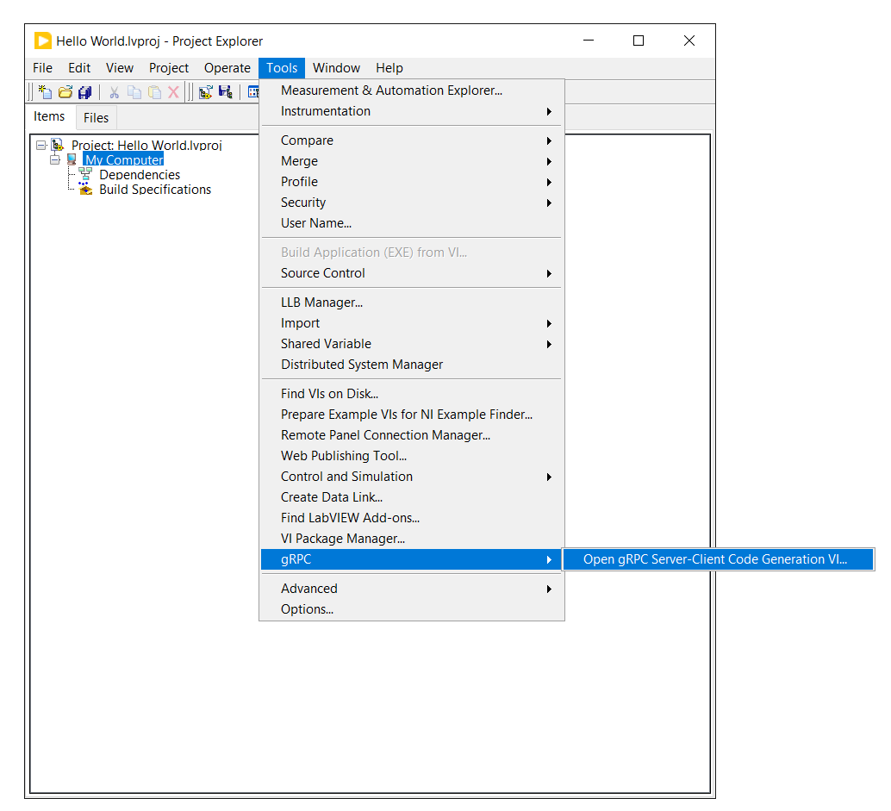
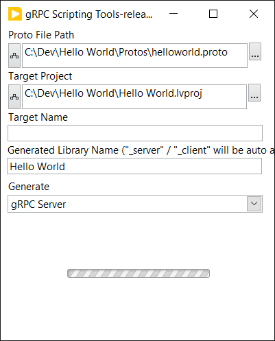
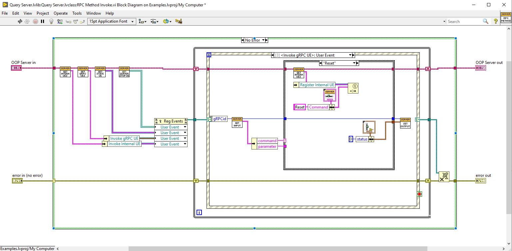
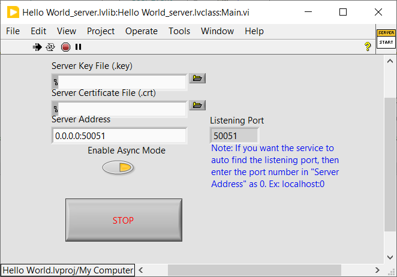

# LabVIEW gRPC Server Creation

## Setup

1. (Windows Only) Download and install the latest [Microsoft Visual C++ Redistributable for Visual Studio 2015, 2017 and 2019](https://support.microsoft.com/en-us/topic/the-latest-supported-visual-c-downloads-2647da03-1eea-4433-9aff-95f26a218cc0).
2. Navigate to the [Releases](https://github.com/ni/grpc-labview/releases) page.
3. Download the latest Server Release `grpc-labview.zip`.
4. Extract the contents of the `.zip` to a directory with read and write permissions.
5. Install the vi package `ni_lib_grpc_server_and_client_template-x.y.z.vip` and `ni_lib_labview_grpc_library-x.y.z.vip`

## Server Creation

You can use the .proto scripting tool on Windows or Linux.

Create a new LabVIEW project or open an existing project.

Launch the scripting tool from the `Tools >> gRPC >> Open gRPC Server-Client Code Generation VI...` menu item.

Enter desired proto file and project.

* Select the .proto file  to parse
* Select the LabVIEW project to update
* (Optional) Enter a target name
* Enter a library name for the gRPC server
* Select to generate gRPC Server or gRPC Client code
* Run the VI to generate the server

You can generate multiple proto files and add them to the same LabVIEW project.  You can also regenerate the same proto file into the same project with the same server name and the existing VIs will be updated to match the proto file. Code you add will not be touched.

Once the project is generated you can implement each of the server RPC methods.  The generated project contains a LabVIEW class with a method for each RPC method:

### There are two ways to implement the server from the generated code.

* You can implement a `synchronous` server where all of the RPC methods are handled by a single event structure in 'Start Sync.vi`
* You can implement an `asynchronus` server where each RPC method is handled by a corresponding LabVIEW Class method

### Async Server Implementation

Each method contains an event structure that registers for a event that is sent when the RPC call is received:

There are also several other events that are created
* Server Stop - sent when the server is stopping.  In response the VI should stop
* Server Internal State - sent when the class state is updated by a call to `Set Server State.vi`
* Invoke Internal - Helper event to enable communication between RPC methods

When the server is started an instance of each of the RPC Method member VIs is run asynchronously to handle parallel calls to different RPC methods.

In you method implementation to must use the Get RPC Method Get Input VI to get the RPC Request parameters and you must call the Set Output VI To set the RPC response of the method and to indicate that the RPC call has completed.

### Run the Server

* Open `Main.vi` from the project.
* Select either `synchronous` or `asynchronous` with the `Enable Async` button
* Fill in the Server Address which is in the form of `[address filter]:[port]`. Using `0.0.0.0:[port]` will allow connections from any computer
* Fill in the path to certificate files if a TLS connection is required, see the section on SSL/TLS Support below for more imformation
* Run the `Main.vi`

