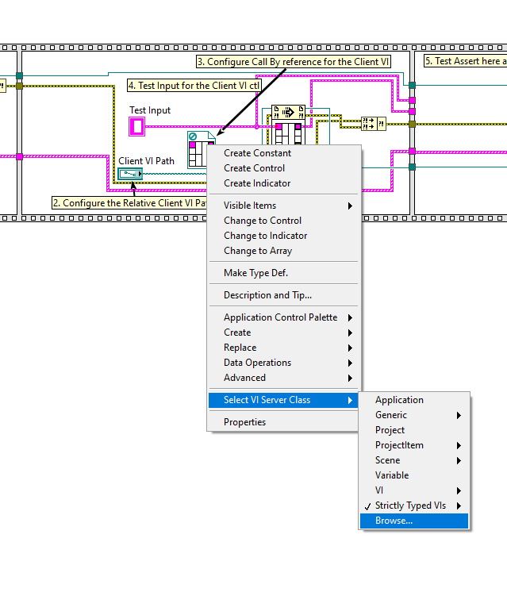

# Test

## Prerequisites
The grpc-libraries that you want to test should be installed in LabVIEW through VI Package Manager. This can be done by following the instructions in [Building.md](/docs/Building.md)

## For Running:

### *All Tests*
Run the [python script](../tests/run_tests.py).

### *Individual Tests*
1. Open the Test VI in LabVIEW 2019.
2. Run it.
3. You will find the test result in the Front Panel fo the VI.

## For writing new Tests
1. Open the [Test Template](../tests/gRPC_ATS/TestUtility/Test_TemplateVI.vit)
2. Configure the Server VI path(The path must be relative to the TestVI location)
3. Configure the Client VI path(The path must be relative to the TestVI location)
4. Configure Call by Reference for the Client VI 
5. Rewire Test Input
6. Test Assert the expected value

## For Adding New Tests

1. Create a Test VI.
2. Add the VI to the [Test Repository](../tests/AutoTests/)
3. Add the Test VI's relative path to [Tests.lst](../tests/Tests.lst)
