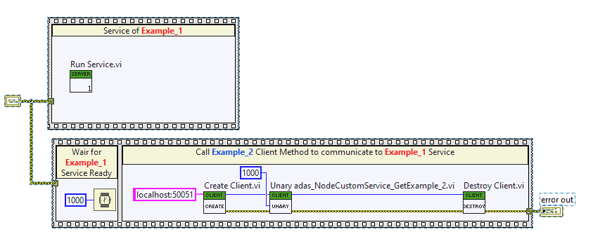

This example is a test for [#issue176](https://github.com/ni/grpc-labview/issues/176). According to the issue, when the client calls a Service that does not exist in the server. It crashed LabVIEW, instead of giving a error.

This test aims to address the mentioned scenario. The test is expected to pass without crashing LabVIEW.